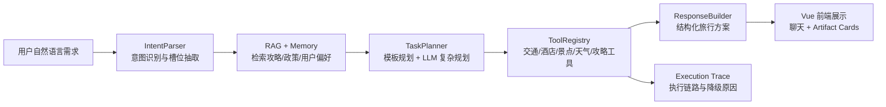
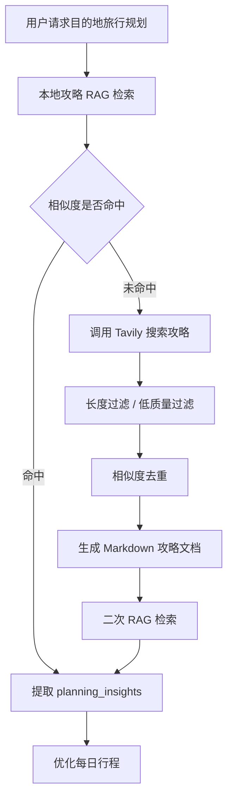

# 梦旅 - 单 Agent 旅行规划工作流

梦旅是一个面向旅行规划场景的单 Agent 工作流项目。它不是简单的聊天机器人，也不是严格意义上的多 Agent 系统，而是将意图识别、任务规划、工具调用、RAG 检索、外部数据接入、长期记忆和执行追踪串成一条完整工程链路，用于根据用户自然语言需求生成可执行的旅行方案。

项目重点是展示 Agent 工程化能力：用户输入一句旅行需求后，系统会自动解析槽位、规划任务、调用交通/酒店/景点/天气/攻略工具，并把检索到的攻略知识转化为内部规划信号，而不是直接把攻略原文贴给用户。

## 项目定位


- **是单 Agent**：核心入口是 `TravelAgent`，内部通过 LangGraph 状态图串联多个能力节点。
- **不是多 Agent**：`IntentParser`、`TaskPlanner`、`RAGRetriever`、`ToolRegistry`、`ResponseBuilder` 是 Agent 内部模块，不是独立自治 Agent。
- **不是预订系统**：当前不接入真实航班库存、酒店 OTA 房态和在线支付，不承诺可订价格或余票。
- **主要价值**：展示 Agent 状态流、RAG 规划信号、工具边界治理、LLM 降级和执行可观测性。

## 核心亮点

- **单 Agent 状态工作流**：基于 LangGraph 构建 `parse_intent -> retrieve_context -> plan_tasks -> execute_tasks -> generate_response` 的多阶段状态图，统一管理 `intent`、`rag_context`、`memory_context`、`tasks`、`tool_results`、`artifacts` 和 `execution_trace`。
- **LLM + 规则双轨降级**：LLM 可用于意图识别和复杂任务规划；未配置 API Key 或模型输出不稳定时，自动回退到确定性规则逻辑，保证系统可运行。
- **自增长 Agentic RAG**：本地攻略知识库未命中时，Agent 可通过 Tavily 搜索目的地攻略，进行长度过滤、相似度去重、Markdown 入库，再次检索复用。
- **攻略作为规划信号**：RAG 不直接输出大段攻略原文，而是提取景点、路线、餐饮、住宿区域和注意事项等 `planning_insights`，用于优化每日行程。
- **真实工具边界治理**：高德 POI、天气、12306 MCP、Tavily、Embedding 等外部能力均有清晰的真实数据边界；不可用时明确降级，不编造航班号、房态、余票或可订价格。
- **MCP 数据源接入**：支持 12306 MCP 查询火车/高铁结果，支持高德 MCP/高德 Web API 获取 POI 信息。
- **长期记忆与多轮上下文**：支持会话内槽位补全、路线纠正、历史行程调整和用户偏好记忆。
- **可观测执行追踪**：每次 Agent 运行会产出 execution trace，记录意图来源、规划模式、工具耗时、降级原因、数据源和失败恢复策略。
- **前后端完整闭环**：后端 FastAPI 提供 REST/WebSocket 接口，前端 Vue 3 + TypeScript 展示聊天、结构化行程卡片、天气/景点 artifact 和执行状态。
- **质量门禁**：内置 pytest、Planner benchmark、Agent E2E、RAG benchmark、前端构建和 Playwright E2E 的统一质量检查脚本。

## 技术栈

| 层级       | 技术                                                       |
| ---------- | ---------------------------------------------------------- |
| Backend    | Python, FastAPI, Pydantic, SQLAlchemy                      |
| Agent      | LangGraph, LangChain Core, OpenAI-compatible LLM Client    |
| LLM        | DeepSeek-compatible / OpenAI-compatible API                |
| RAG        | FAISS, Markdown Retriever, Tavily Search, Embedding Client |
| Embedding  | 阿里云百炼 `text-embedding-v4` compatible endpoint         |
| Tools      | 高德 POI/天气/路线、12306 MCP、Tavily、MCP Client          |
| Cache      | Redis with in-memory fallback                              |
| Frontend   | Vue 3, TypeScript, Vite, Playwright                        |
| Quality    | pytest, frontend build, E2E, custom quality gate           |
| Deployment | Docker, docker-compose                                     |

## Agent 工作流

当前实现是单 Agent 内部的线性工作流。选择 LangGraph 不是因为项目已经是多 Agent，而是为了把 Agent 内部的状态边界显式化，并为后续条件分支、失败恢复、checkpoint 和人工确认预留扩展空间。



一次完整旅行规划通常会经过：

1. 解析用户输入中的出发地、目的地、日期、天数、预算、偏好。
2. 判断是否缺少关键槽位，必要时先追问。
3. 检索目的地攻略知识库；低置信未命中时触发 Tavily 搜索并入库。
4. 规划并执行交通、酒店、景点、天气、攻略和行程生成任务。
5. 将工具结果和 RAG 规划信号融合成最终旅行计划。
6. 保存对话历史、结构化 artifacts 和执行 trace。

## 自增长 RAG 设计

梦旅的攻略知识库不是固定静态文档，而是具备自增长能力。



关键工程点：

- 使用相似度阈值判断本地知识是否可用。
- 搜索内容入库前进行长度过滤，避免短内容污染向量库。
- 与已有 chunk 做相似度去重，避免重复文档导致检索质量下降。
- 对小红书站点壳、备案页、广告话术、图片链接、导游营销文本做过滤。
- 生成的攻略文档持久化到 `rag/documents/guides/generated/`，后续相同目的地可复用。

## 工具能力与数据边界

梦旅强调真实数据边界：能查到真实结果就展示，查不到就明确降级，不用 mock 伪装成真实数据。

| 能力      | 当前实现               | 数据边界                                                     |
| --------- | ---------------------- | ------------------------------------------------------------ |
| 火车/高铁 | 12306 MCP              | 展示真实 MCP 返回的车次、站点、时间、席别/票价字段           |
| 航班      | 高德机场 POI 衔接      | 当前不生成航班号、票价、舱位、余票                           |
| 酒店      | 高德 POI / 高德 MCP    | 展示真实酒店 POI、地址、评分、电话；不生成房态、房型、可订价格 |
| 景点      | 高德 POI + 动态 RAG    | 展示真实 POI 和来源；可结合攻略信号优化行程                  |
| 天气      | 高德天气 API           | 展示目的地天气预报和旅行建议                                 |
| 攻略      | 本地 RAG + Tavily 搜索 | 攻略作为内部规划依据，完整旅行规划不直接展示攻略原文         |
| 记忆      | 短期记忆 + 长期偏好    | 支持多轮槽位填充、偏好复用和行程修改                         |

## 项目结构

```text
trip-assistant/
├── app/                    # FastAPI 应用入口、API 协议、配置
├── core/                   # Agent 编排、意图识别、任务规划、记忆、trace
│   ├── llm/                # OpenAI-compatible LLM 客户端、prompt、JSON 修复、质量审计
│   └── memory/             # 短期记忆、长期记忆、偏好抽取
├── tools/                  # 交通、酒店、景点、攻略、政策、天气、路线工具
├── rag/                    # 本地检索、自增长攻略生成、Embedding、动态 RAG
│   └── documents/          # 本地政策/攻略 Markdown 知识库
├── frontend/               # Vue 3 + TypeScript 前端
├── tests/                  # 后端单测、Agent 链路测试、工具测试
├── scripts/                # 质量门禁和评测脚本
├── data/                   # SQLite 数据、会话历史、运行数据
├── Dockerfile
├── docker-compose.yml
└── requirements.txt
```

## 快速启动

### 1. 后端

```powershell
cd trip-assistant
python -m venv .venv
.venv\Scripts\activate
pip install -r requirements.txt
copy .env.example .env
```

macOS / Linux:

```bash
cp .env.example .env
```

按需在 `.env` 中配置 API Key，然后启动：

```powershell
uvicorn app.main:app --host 0.0.0.0 --port 8000 --reload
```

后端地址：

- API: `http://localhost:8000`
- Swagger: `http://localhost:8000/docs`

### 2. 前端

```powershell
cd frontend
npm install
npm run dev
```

前端地址：

```text
http://localhost:5173
```

如果后端改用其他端口，例如 `8001`：

```powershell
$env:VITE_API_TARGET="http://127.0.0.1:8001"
npm run dev -- --port 5173
```

## 环境变量

复制 `.env.example` 为 `.env` 后配置。

核心配置：

```env
# LLM
LLM_PROVIDER=deepseek
LLM_MODEL=deepseek-v4-flash
LLM_API_KEY=
LLM_BASE_URL=https://api.deepseek.com
LLM_PLANNER_MODE=auto
ITINERARY_LLM_ENABLED=true

# Embedding
EMBEDDING_MODEL=text-embedding-v4
EMBEDDING_API_KEY=
EMBEDDING_BASE_URL=https://dashscope.aliyuncs.com/compatible-mode/v1

# Tavily Search
TAVILY_SEARCH_ENABLED=true
TAVILY_API_KEY=

# AMap
AMAP_API_KEY=

# MCP
MCP_ENABLED=true
MCP_12306_ENABLED=true
MCP_AMAP_ENABLED=true

# Cache
EXTERNAL_API_CACHE_BACKEND=redis
REDIS_URL=redis://localhost:6379/0
```

说明：

- 未配置 `LLM_API_KEY` 时，系统使用规则 fallback。
- 未配置 `EMBEDDING_API_KEY` 时，系统使用本地确定性向量降级。
- 未配置 `TAVILY_API_KEY` 时，不会编造攻略，只会明确降级。
- Redis 不可用时，外部 API 缓存会降级为内存缓存。

## Docker 启动

```powershell
docker compose up --build
```

兼容旧版 Docker Compose 命令：

```powershell
docker-compose up -d
```

默认启动：

- Backend: `http://localhost:8000`
- Redis: compose 内部服务

Redis 仅在 compose 内部网络暴露，不直接映射到宿主机端口。

## API 示例

```powershell
Invoke-RestMethod `
  -Uri http://localhost:8000/api/chat `
  -Method POST `
  -ContentType "application/json" `
  -Body '{"message":"我想从太原去郑州玩3天，预算3000，偏好历史文化和当地美食"}'
```

响应包含：

- `response`：面向用户的旅行规划文本
- `artifacts`：前端可展示的结构化行程、景点、天气、路线等数据
- `execution_trace`：Agent 执行链路、工具状态、耗时、降级原因

## 质量门禁

运行完整质量门禁：

```powershell
.venv\Scripts\python.exe scripts\run_quality_gate.py
```

输出机器可读结果：

```powershell
.venv\Scripts\python.exe scripts\run_quality_gate.py --json-compact
```

质量门禁包含：

- 后端 pytest
- Planner 质量评测
- Agent E2E 评测
- RAG 质量评测
- 前端 TypeScript/Vite 构建
- Playwright E2E

也可以单独运行：

```powershell
.venv\Scripts\python.exe -m pytest -q tests --tb=short
cd frontend
npm run build
npm run test:e2e
```
