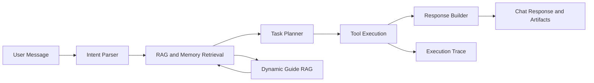

# 梦旅

一个面向旅行规划场景的全栈 Agent 项目。系统接收用户的自然语言旅行需求，完成意图识别、上下文检索、任务规划、工具调用、RAG 增强、长期偏好记忆、LLM 行程生成与结构化结果展示。

项目重点不是做一个完整 OTA 预订平台，而是展示 Agent 工程能力：如何把用户一句模糊的旅行需求转成可执行任务链，如何治理外部工具数据边界，如何让 RAG 影响规划决策，如何在 LLM/API 不稳定时保持可降级运行，并通过 execution trace 和质量门禁保证系统可观测、可测试。

## 核心能力

- 自然语言意图识别：识别旅行规划、景点查询、酒店查询、交通查询、天气查询、攻略问答、行程修改等请求。
- 槽位抽取与多轮上下文：支持出发地、目的地、日期、天数、预算、偏好等信息抽取，并在多轮对话中补全缺失信息。
- LangGraph 工作流编排：通过 `parse_intent -> retrieve_context -> plan_tasks -> execute_tasks -> generate_response` 串联 Agent 执行链路。
- 工具调用：封装景点、酒店、机场 POI、火车/高铁、天气、路线、攻略、政策、行程生成等工具。
- LLM 行程生成：配置 LLM Key 后优先使用 OpenAI-compatible 模型生成行程；失败或未配置时回退到规则行程。
- 动态 RAG：本地攻略未命中时，可通过 Tavily 搜索目的地攻略，清洗、过滤、去重后持久化为 Markdown 文档，并再次检索用于后续规划。
- 长期记忆：记录用户旅行偏好，并在后续规划中复用。
- 偏好抽取决策：规则优先抽取偏好，规则置信度不足或语义抽象时再调用 LLM，并记录可解释评分报告。
- 数据边界治理：不编造航班号、票价、舱位、余票、酒店房态、房型或可订价格；查不到真实数据时明确降级。
- 结构化前端展示：Vue 前端展示聊天结果、行程卡片、景点/天气/路线 artifacts 和执行状态。
- 质量门禁：内置后端测试、Planner benchmark、Agent E2E、RAG benchmark、前端构建和 Playwright E2E。

## 技术栈

| 层级       | 技术                                                         |
| ---------- | ------------------------------------------------------------ |
| 后端       | Python, FastAPI, Pydantic                                    |
| Agent 编排 | LangGraph, LangChain Core                                    |
| LLM        | OpenAI-compatible client, DeepSeek-compatible configuration  |
| RAG        | Markdown Retriever, FAISS, EmbeddingManager, Tavily Search   |
| Embedding  | OpenAI-compatible embedding endpoint，默认配置兼容阿里云百炼 `text-embedding-v4` |
| 外部数据   | 高德 POI/路线/天气，12306 MCP，Tavily Search                 |
| 记忆       | Short-term memory, Episodic memory, Long-term preference memory |
| 缓存       | Redis backend with in-memory fallback                        |
| 前端       | Vue 3, TypeScript, Vite, @lucide/vue                         |
| 测试       | pytest, Playwright, custom quality gate scripts              |
| 部署       | Docker, docker-compose                                       |

## 系统流程



一次完整旅行规划通常包含：

1. 解析用户输入中的目的地、出发地、日期、天数、预算和偏好。
2. 检索本地攻略、动态攻略和长期偏好记忆。
3. 根据意图和上下文生成任务列表。
4. 调用交通、酒店、景点、天气、攻略和行程生成工具。
5. 将工具结果与 RAG 规划信号融合为最终行程。
6. 返回文本回答、结构化 artifacts 和 execution trace。

## RAG 设计

项目包含两类 RAG 数据：

- 本地 Markdown 知识库：存放静态攻略、政策等文档。
- 动态生成攻略：当目的地攻略检索未命中时，系统可调用 Tavily 搜索，筛选高质量内容，切片、去重并持久化到 `rag/documents/guides/generated/`。

动态 RAG 的关键处理包括：

- 相似度阈值判断本地知识是否命中。
- Tavily 搜索结果长度过滤，去掉过短噪声内容。
- 低质量内容过滤，避免站点壳、广告页、空摘要污染知识库。
- 基于 embedding 相似度去重，避免重复 chunk 降低检索质量。
- 攻略内容不作为原文大段展示，而是提取为规划信号参与行程生成。

## 长期偏好记忆

系统会从用户对话中抽取长期旅行偏好，例如：

- 出行风格：慢节奏、深度游、低强度、亲子等。
- 酒店偏好：地铁附近、交通方便、安静、舒适型酒店等。
- 交通偏好：高铁优先、飞机优先、少换乘、直达等。
- 景点偏好：自然风光、人文历史、海边、拍照、美食等。
- 饮食与排除项：不吃辣、不喝酒、排除购物、排除赶场式行程等。

偏好抽取采用规则优先策略。系统会计算一份 `PreferenceExtractionReport`：

- `preference_intent_score`：用户消息是否像长期偏好表达。
- `rule_confidence`：规则抽取结果是否足够可信。
- `category_count`：命中的偏好类别数。
- `raw_hit_count`：规则命中的偏好标签数。
- `abstract_marker_count`：抽象偏好表达命中数。
- `ambiguity_score`：语义模糊度。
- `should_use_llm`：是否需要调用 LLM 做语义归纳。
- `decision_reason`：触发或不触发 LLM 的原因。

当规则命中明确时直接使用规则结果；当偏好意图明显但规则覆盖不足、规则置信度低、或存在较强抽象表达时，才调用 LLM 归纳偏好。LLM 输出会经过 schema、白名单和值域校验，避免污染长期记忆。

## 工具能力与数据边界

| 能力      | 当前实现                     | 数据边界                                                     |
| --------- | ---------------------------- | ------------------------------------------------------------ |
| 景点      | 高德 POI + 动态 RAG 文档     | 返回真实 POI 或明确降级；不编造景点事实                      |
| 酒店      | 高德 MCP / 高德 POI          | 返回酒店 POI、地址、评分、电话等；不生成 OTA 房态、房型、可订价格 |
| 航班/机场 | 高德机场 POI                 | 当前只返回机场 POI 和机场衔接建议；不返回真实航班号、票价、舱位、余票 |
| 火车/高铁 | 12306 MCP                    | 返回 MCP 查询到的车次、站点、时间、席别/票价字段             |
| 天气      | 高德天气 API                 | 返回天气预报和旅行建议；无 Key 时按配置降级                  |
| 路线      | 高德路线能力 / 本地排序逻辑  | 用于景点路线优化和距离衔接，不承诺实时交通状态               |
| 攻略      | 本地 Markdown RAG + Tavily   | 攻略作为规划依据，不直接输出大段原文                         |
| 记忆      | 短期对话、情景记录、长期偏好 | 用于多轮补槽、历史行程调整和偏好复用                         |

## 项目结构

```text
trip-assistant/
├── app/                    # FastAPI 应用、API 协议、配置
├── core/                   # Agent 编排、意图识别、规划、执行、记忆、trace
│   ├── llm/                # OpenAI-compatible LLM client、prompt、JSON 修复、质量检查
│   └── memory/             # 短期记忆、长期偏好、偏好抽取
├── tools/                  # 景点、酒店、交通、天气、路线、攻略、政策、行程工具
├── rag/                    # 检索、embedding、动态攻略生成、动态 RAG store
│   └── documents/          # 本地 Markdown 知识库
├── frontend/               # Vue 3 + TypeScript 前端
├── tests/                  # 后端单测、Agent 链路测试、工具测试
├── scripts/                # 质量门禁和评测脚本
├── data/                   # 本地运行数据
├── Dockerfile
├── docker-compose.yml
└── requirements.txt
```

## 快速启动

### 1. 后端

Windows PowerShell：

```powershell
cd trip-assistant
python -m venv .venv
.venv\Scripts\activate
pip install -r requirements.txt
copy .env.example .env
uvicorn app.main:app --host 0.0.0.0 --port 8001 --reload
```

macOS / Linux：

```bash
cd trip-assistant
python -m venv .venv
source .venv/bin/activate
pip install -r requirements.txt
cp .env.example .env
uvicorn app.main:app --host 0.0.0.0 --port 8001 --reload
```

后端地址：

- API: `http://localhost:8001`
- Swagger: `http://localhost:8001/docs`

### 2. 前端

```powershell
cd frontend
npm install
npm run dev
```

默认前端地址：

```text
http://localhost:5173
```

前端 Vite 代理默认指向 `http://127.0.0.1:8001`。如果后端使用其他端口，可以设置代理目标：

```powershell
$env:VITE_API_TARGET="http://127.0.0.1:8000"
npm run dev -- --port 5173
```

## 环境变量

复制 `.env.example` 为 `.env` 后按需填写。不要提交真实 Key。

核心配置示例：

```env
APP_ENV=development
DEBUG=true
HOST=0.0.0.0
PORT=8000

LLM_PROVIDER=deepseek
LLM_MODEL=deepseek-v4-flash
LLM_API_KEY=
LLM_BASE_URL=https://api.deepseek.com
LLM_PLANNER_MODE=auto
ITINERARY_LLM_ENABLED=true

EMBEDDING_PROVIDER=openai
EMBEDDING_MODEL=text-embedding-v4
EMBEDDING_API_KEY=
EMBEDDING_BASE_URL=https://dashscope.aliyuncs.com/compatible-mode/v1

TAVILY_SEARCH_ENABLED=true
TAVILY_API_KEY=

AMAP_API_KEY=
WEATHER_API_KEY=

MCP_ENABLED=true
MCP_12306_ENABLED=true
MCP_AMAP_ENABLED=true

EXTERNAL_API_CACHE_ENABLED=true
EXTERNAL_API_CACHE_BACKEND=redis
REDIS_URL=redis://localhost:6379/0
```

说明：

- 未配置 `LLM_API_KEY` 时，系统使用规则 fallback，不请求真实 LLM。
- 未配置 `EMBEDDING_API_KEY` 时，系统使用本地确定性向量降级。
- 未配置 `TAVILY_API_KEY` 时，动态攻略搜索会明确降级，不编造攻略。
- `WEATHER_API_KEY` 可选；为空时天气客户端可复用 `AMAP_API_KEY`。
- Redis 不可用时，外部 API 缓存会降级为内存缓存。

## API 示例

### 聊天接口

```powershell
Invoke-RestMethod `
  -Uri http://localhost:8001/api/chat `
  -Method POST `
  -ContentType "application/json" `
  -Body '{"message":"我想从太原去郑州玩3天，预算3000，偏好历史文化和当地美食"}'
```

响应包含：

- `session_id`：会话 ID。
- `response`：面向用户的旅行规划文本。
- `artifacts`：前端可展示的结构化行程、景点、天气、路线等数据。
- `execution_trace`：Agent 执行链路、工具状态、耗时、降级原因等信息。

### 状态接口

```text
GET /api/external/status
GET /api/llm/status
GET /api/history/{session_id}
GET /api/history/{session_id}/runs
DELETE /api/history/{session_id}
WS  /ws/chat
```

状态接口不会返回真实 API Key。

## Docker 启动

```powershell
docker compose up --build
```

兼容旧命令：

```powershell
docker-compose up -d
```

默认服务：

- Backend: `http://localhost:8000`
- Redis: compose 内部服务

## 测试与质量门禁

运行完整质量门禁：

```powershell
.venv\Scripts\python.exe scripts\run_quality_gate.py
```

质量门禁包含：

- 后端 pytest
- Planner quality benchmark
- Agent E2E benchmark
- RAG quality benchmark
- 前端 TypeScript/Vite build
- Playwright E2E

也可以单独运行：

```powershell
.venv\Scripts\python.exe -m pytest -q tests --tb=short
.venv\Scripts\python.exe scripts\evaluate_agent_e2e.py --json-compact
.venv\Scripts\python.exe scripts\evaluate_planner_quality.py --json-compact
.venv\Scripts\python.exe scripts\evaluate_rag_quality.py --json-compact

cd frontend
npm run build
npm run test:e2e
```
