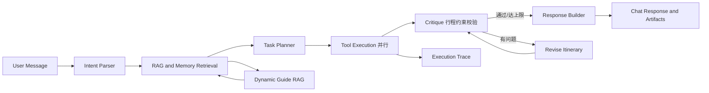

# 梦旅  · 旅行规划 Agent

一个面向旅行规划场景的全栈 LLM Agent（FastAPI + LangGraph + RAG + Vue3）。系统接收自然语言旅行需求，完成意图识别、上下文检索、任务规划、工具调用、RAG 增强、长期偏好记忆、LLM 行程生成，并通过**反思自纠闭环**保证行程质量。

项目重点不是做一个完整 OTA 预订平台，而是展示 **Agent 工程能力**：把一句模糊需求转成可执行任务链、治理外部工具数据边界、让 RAG 影响规划决策、在 LLM/API 不稳定时保持可降级运行，并通过 execution trace + 质量门禁保证系统可观测、可测试。

## 核心能力

- **LangGraph 工作流 + 反思自纠闭环**：`parse_intent → retrieve_context → plan_tasks → execute_tasks → critique → generate_response`。critique 节点用规则校验行程约束（天数匹配、无空天、慢节奏不过密），不满足时自动修订（Reflexion 式自纠，最多 2 轮），让图具备真正的条件边与循环。
- **混合检索 RAG**：BM25（CJK 字 + bigram 分词）+ 稠密向量（百炼 text-embedding-v4，1024 维）混合，可选 cross-encoder 精排。
- **可插拔重排器**：`KeywordReranker`（轻量）/ `CrossEncoderReranker`（本地 BGE-reranker，延迟加载）/ `DashScopeReranker`（百炼 qwen3-rerank API，复用 embedding key，失败降级）。
- **可插拔向量库**：`InMemoryVectorStore`（精确 cosine + 落盘持久化，消除冷启动重算）/ `FAISSVectorStore`（IVF 近似，小语料自动退化为精确扫描）。
- **自增长攻略 RAG**：本地攻略未命中时，Tavily 搜索 → 质量过滤/去重 → 持久化为 Markdown → 再次检索参与规划。
- **并行工具执行**：按任务依赖图（`depends_on`）拓扑分层，同层 `asyncio.gather` 并发，跨层串行保证依赖结果注入。
- **三层记忆**：短期对话 / 情景（向量检索，修复了原 `split()` 对中文失效的问题）/ 长期偏好（结构化，带 evidence 与 planning_profile）。
- **规则优先 + LLM 兜底**：意图识别、任务规划、偏好抽取三处均带可解释决策报告（confidence、skip_reason、should_use_llm），降低成本与延迟。
- **MCP 集成**：基于官方 MCP SDK，stdio/SSE 双传输，统一治理 12306 / 高德多源工具。
- **数据边界治理**：不编造航班号、票价、舱位、余票、酒店房态或可订价格；查不到真实数据时明确降级。
- **全栈与可观测**：FastAPI + Vue3 + WebSocket 流式；execution trace 含失败分类、降级策略、耗时；Docker 一键启动。

## 技术栈

| 层级       | 技术                                                         |
| ---------- | ------------------------------------------------------------ |
| 后端       | Python, FastAPI, Pydantic                                    |
| Agent 编排 | LangGraph（条件边 + 反思循环）, LangChain Core               |
| LLM        | OpenAI-compatible client（DeepSeek 等）                      |
| RAG 检索   | BM25（CJK 分词）+ 稠密向量混合检索                           |
| 向量库     | InMemoryVectorStore（精确，持久化）/ FAISSVectorStore（IVF） |
| Embedding  | 百炼 text-embedding-v4（1024 维，OpenAI-compatible）         |
| 重排       | Keyword / CrossEncoder（BGE-reranker）/ DashScope（qwen3-rerank） |
| 外部数据   | 高德 POI/路线/天气，12306 MCP，Tavily Search                 |
| 记忆       | 短期对话、情景向量、长期偏好                                 |
| 缓存       | Redis backend with in-memory fallback                        |
| 前端       | Vue 3, TypeScript, Vite                                      |
| 测试       | pytest, Playwright, 自研质量门禁 + 消融/crossover 基准       |
| 部署       | Docker, docker-compose                                       |

## 系统流程



## 评测结果（实测）

| 指标                                       | 结果                                                         |
| ------------------------------------------ | ------------------------------------------------------------ |
| 后端 pytest                                | 286+ passed                                                  |
| RAG 消融（真实 embedding，8 例含语义改写） | BM25 top1=0.50 / recall@3=0.88；hybrid 同；**+DashScope 重排 top1=0.62** |
| FAISS IVF crossover（1024 维）             | 50k 向量查询 P50：精确 154ms → FAISS IVF 10ms（约 15×），nprobe 调参下 recall@10 可达 1.0 |
| 反思自纠                                   | critique 检出行程天数不符、空天、慢节奏过密三类约束问题      |

详见 `scripts/evaluate_rag_ablation.py`、`scripts/benchmark_faiss_crossover.py`。

## 快速启动

### 1. 后端

Windows PowerShell：

```powershell
cd trip-assistant
python -m venv .venv
.venv\Scripts\activate
pip install -r requirements.txt
copy .env.example .env
uvicorn app.main:app --host 0.0.0.0 --port 8001 --reload
```

macOS / Linux：

```bash
cd trip-assistant
python -m venv .venv
source .venv/bin/activate
pip install -r requirements.txt
cp .env.example .env
uvicorn app.main:app --host 0.0.0.0 --port 8001 --reload
```

后端地址：API `http://localhost:8001`，Swagger `http://localhost:8001/docs`。

### 2. 前端

```powershell
cd frontend
npm install
npm run dev
```

默认前端地址 `http://localhost:5173`，Vite 代理默认指向 `http://127.0.0.1:8001`。

## 环境变量

复制 `.env.example` 为 `.env` 后按需填写，**不要提交真实 Key**。核心配置：

```env
LLM_PROVIDER=deepseek
LLM_MODEL=deepseek-v4-flash
LLM_API_KEY=
LLM_BASE_URL=https://api.deepseek.com
LLM_PLANNER_MODE=auto
ITINERARY_LLM_ENABLED=true

EMBEDDING_PROVIDER=openai
EMBEDDING_MODEL=text-embedding-v4
EMBEDDING_API_KEY=
EMBEDDING_BASE_URL=https://dashscope.aliyuncs.com/compatible-mode/v1

TAVILY_SEARCH_ENABLED=true
TAVILY_API_KEY=
AMAP_API_KEY=
WEATHER_API_KEY=
MCP_ENABLED=true
EXTERNAL_API_CACHE_BACKEND=redis
REDIS_URL=redis://localhost:6379/0
```

说明：

- 未配置 `LLM_API_KEY` 时使用规则 fallback，不请求真实 LLM。
- 未配置 `EMBEDDING_API_KEY` 时使用本地确定性向量降级。
- `DashScopeReranker` 默认复用 `EMBEDDING_API_KEY`（同一百炼账号）；也可单独设 `RERANK_API_KEY`。
- Redis 不可用时，外部 API 缓存降级为内存缓存。

## API 示例

```powershell
Invoke-RestMethod `
  -Uri http://localhost:8001/api/chat `
  -Method POST `
  -ContentType "application/json" `
  -Body '{"message":"我想从太原去郑州玩3天，预算3000，偏好历史文化和当地美食"}'
```

响应包含 `session_id`、`response`（行程文本）、`artifacts`（结构化行程/景点/天气/路线）、`execution_trace`（执行链路、工具状态、耗时、降级原因）。

状态接口：`GET /api/external/status`、`GET /api/llm/status`、`GET /api/history/{session_id}`、`WS /ws/chat`。状态接口不会返回真实 API Key。

## Docker 启动

```powershell
docker compose up --build
```

兼容旧命令：

```powershell
docker-compose up -d
```

默认服务：Backend `http://localhost:8000`；**Redis 仅在 compose 内部网络暴露**（不对外映射端口，避免缓存服务公网可达）。

## 测试与质量门禁

运行完整质量门禁：

```powershell
.venv\Scripts\python.exe scripts\run_quality_gate.py
```

质量门禁包含：后端 pytest、Planner quality benchmark、Agent E2E benchmark、RAG quality benchmark、前端构建、Playwright E2E。

单独运行评测/基准（含消融与 FAISS crossover）：

```powershell
.venv\Scripts\python.exe -m pytest -q tests --tb=short
.venv\Scripts\python.exe scripts\evaluate_agent_e2e.py --json-compact
.venv\Scripts\python.exe scripts\evaluate_planner_quality.py --json-compact
.venv\Scripts\python.exe scripts\evaluate_rag_quality.py --json-compact
.venv\Scripts\python.exe scripts\evaluate_rag_ablation.py --use-configured-embedding --reranker dashscope
.venv\Scripts\python.exe scripts\benchmark_faiss_crossover.py
```

## 项目结构

```text
trip-assistant/
├── app/                    # FastAPI 应用、API 协议、配置
├── core/                   # Agent 编排（含 critique/revise 反思闭环）、意图、规划、并行执行、记忆、trace
│   ├── llm/                # LLM client、prompt 注册表（版本化）、JSON 修复、质量审计
│   └── memory/             # 短期、情景（向量）、长期偏好、偏好抽取
├── tools/                  # 景点、酒店、交通、天气、路线、攻略、政策、行程工具
├── rag/                    # BM25、向量库（InMemory/FAISS IVF）、混合检索、重排（3 后端）、动态攻略生成
│   └── documents/          # 本地 Markdown 知识库
├── frontend/               # Vue 3 + TypeScript 前端
├── tests/                  # 后端单测、Agent 链路、工具、质量评测测试
├── scripts/                # 质量门禁、消融、FAISS crossover、评测脚本
└── docs/                   # 优化方案与设计文档
```
